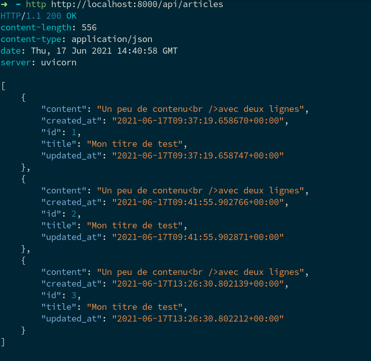

+++
title="Le guide complet du débutant avec FastAPI - Partie 2 : templates html, base de données et documentation"
date="2021-06-20T19:33:20+01:00"

[taxonomies]
author = ["Vincent Jousse"]
tags = ["python", "framework", "fastapi", "web", "fastapi-tutorial"]
+++

J'ai toujours aimé apprendre par l'exemple et ce guide ne dérogera pas à la règle. Nous allons prendre comme prétexte la création d'un projet pour apprendre à nous servir de FastAPI. Nous allons développer une application de [publication de contenu/newsletter à la Substack](https://substack.com/).

<!-- more -->

## Projet : une newsletter à la Substack

Les principales fonctionnalités que nous développerons :
- Création d'articles
- Envoi des articles par email
- Gestion des utilisateurs avec inscription et authentification

Plein de bonus possibles :
- Gestion du multilingue
- Traduction automatique des articles
- Commentaires sur les articles
- Conversion du contenu en audio

### Structure de notre projet FastAPI

À la différence de beaucoup de Framework, FastAPI n'impose __aucune structure de répertoires__ ou de fichiers pour pouvoir fonctionner. Quelques __conventions__ se dégagent cependant parmi tous les projets disponibles. Voici celle que nous allons adopter :

```
fastapi-beginners-guide/   <-- répertoire racine de notre projet
├── app/                   <-- répertoire contenant le code Python
│   ├── core/              <-- fichiers partagés (config, exceptions, …)
│   │   └── __init__.py
│   ├── crud/              <-- création, récupération, mises à jour des données
│   │   └── __init__.py
│   ├── __init__.py
│   ├── main.py            <-- point d'entrée de notre programme FastAPI
│   ├── models/            <-- les modèles de notre base de données
│   │   └── __init__.py
│   ├── schemas/           <-- les schémas de validation des modèles
│   │   └── __init__.py
│   ├── templates/         <-- fichiers html/jinja
│   ├── tests/             <-- tests
│   │   └── __init__.py
│   └── views/             <-- fonctions gérant les requêtes HTTP
│       └── __init__.py
├── public/                <-- fichiers CSS, Javascript et fichiers statiques
└── venv/                  <-- environnement virtuel créé à la partie 1
```

Créez une structure de répertoire identique à celle ci-dessus. Vous ne devriez pas avoir à créer le répertoire `venv` puisque il a du être créé automatiquement suite à la [partie 1](/articles/le-guide-complet-du-debutant-avec-fastapi-partie-1/). Les fichiers `__init__.py` sont des fichiers vides nécessaires pour que Python puisse considérer vos répertoires comme des packages.

Copie/collez le code de la partie 1 dans le fichier `app/main.py` :

```python
# app/main.py
from fastapi import FastAPI

app = FastAPI()


@app.get("/")
async def root():
    return {"message": "Hello World"}
```

Déplacez vous à la racine du projet puis activez l'environnement virtuel :

```
$ source ./venv/bin/activate
```

Assurez-vous ensuite que vous pouvez lancer `uvicorn` avec la commande suivante :


```
(venv) $ uvicorn app.main:app --reload
```

Le type de résultat attendu :

```
INFO:     Uvicorn running on http://127.0.0.1:8000 (Press CTRL+C to quit)
INFO:     Started reloader process [10884] using watchgod
INFO:     Started server process [10886]
INFO:     Waiting for application startup.
INFO:     Application startup complete.
```

Notez la différence avec la commande de la [partie 1](/articles/le-guide-complet-du-debutant-avec-fastapi-partie-1/) : nous avons rajouté un `app.` devant le `main`. Celui-ci correspond au répertoire `app/` que nous venons de créer dans lequel se situe notre fichier `main.py`. Je rappelle que le `app` situé après le `:` est le nom de l'objet FastAPI qui a été créé dans notre fichier `main.py`.

### Première page HTML

Nous allons maintenant créer la première page de notre « site web » avec de l'HTML et du CSS.

Copiez collez le code ci-dessous dans votre fichier `app/main.py`.

```python
# app/main.py
from fastapi import FastAPI, Request
from fastapi.staticfiles import StaticFiles
from fastapi.templating import Jinja2Templates

app = FastAPI()

app.mount("/static", StaticFiles(directory="public"), name="public")

templates = Jinja2Templates(directory="app/templates")


@app.get("/")
async def root(request: Request):
    return templates.TemplateResponse("home.html", {"request": request})
```

Décortiquons ce que nous venons de faire.

```python
app.mount("/static", StaticFiles(directory="public"), name="public")
```

Nous « _montons_ » (`app.mount`) une route qui va répondre à l'URL `/static` et qui servira, sous cette adresse, les fichiers que nous mettrons dans le répertoire `public/` précédemment créé (`directory="public"`). Nous nommons cette route `public` (`name="public"`), car nous aurons besoin de l'appeler par son nom pour nous en servir un peu plus loin. Toto aurait aussi fonctionné comme nom, mais c'est moins parlant 😉

__En résumé__ : Si nous plaçons un fichier nommé `styles.css` dans notre répertoire `public/`, cette route va nous permettre d'y accéder par l'adresse `http://localhost:8000/public/styles.css`.

```python
templates = Jinja2Templates(directory="app/templates")
```

Nous créons un objet (`templates`) qui va nous permettre de créer de l'HTML avec le moteur de templates [Jinja2](https://jinja2docs.readthedocs.io/en/stable/). Cet objet ira chercher ses templates dans le répertoire que nous avons créé, `app/templates/`.


```python
@app.get("/")
async def root(request: Request):
    return templates.TemplateResponse("home.html", {"request": request})
```

Nous avons ensuite modifié notre méthode `root` pour qu'elle récupère l'objet `request`. Cet objet est fourni par FastAPI (plus précisement par [starlette](https://www.starlette.io), Framework sur lequel FastAPI est basé) et permet d'obtenir des informations sur la requête : l'URL d'origine, les cookies, les headers, etc. La documentation complète est disponible ici : https://www.starlette.io/requests/. Nous y reviendrons.

Au lieu de retourner un simple dictionnaire Python comme précédemment, notre méthode renvoie maintenant un objet `TemplateResponse`. C'est un objet qui va être en charge de créer du HTML à partir d'un template, `home.html` dans notre cas. Il ira chercher ce template dans le répertoire que nous avons spécifié plus haut avec `directory="app/templates"`.

Notez le dictionnaire Python passé deuxième paramètre, `{"request": request}`. Ce dictionnaire va nous permettre de passer des données de notre vue à notre template. Dans ce cas précis, nous passons la requête en paramètre. La clé du dictionnaire `"request"` est le nom que nous voulons donner à notre valeur dans le template et la valeur du dictionnaire `request` est la valeur que nous souhaitons passer au template sous ce nom.

Il nous faut ensuite créer le contenu du template dans `app/templates/home.html`. Copiez-collez le code suivant :

```jinja
<!DOCTYPE html>
<html>
<head>
    <title>Home</title>
    <link href="{{ url_for('public', path='/styles.css') }}" rel="stylesheet">
</head>
<body>
    <h1>Home title</h1>
    <p>Current url: <strong>{{ request.url }}</strong></p>
</body>
</html>
```

Outre le code HTML classique, la première ligne intéressante est la suivante :
```jinja
<link href="{{ url_for('public', path='/styles.css') }}" rel="stylesheet">
```

Nous construisons un lien dynamique grâce à la fonction `url_for`. Cette fonction prend en paramètres le nom de la route, `public` dans notre cas (le nom que nous avions donné plus haut, lors du `app.mount`) et l'emplacement du fichier, `path='/styles.css'`, qu'il nous restera à créer. Avec Jinja, tout ce qui est entre `{{` et `}}` sera affiché dans le code HTML.

L'autre ligne intéressante est celle-ci :
```jinja
<p>Current url: <strong>{{ request.url }}</strong></p>
```
Ici nous nous servons de l'objet `request` de starlette que nous avions passé à notre template (`templates.TemplateResponse("home.html", {"request": request})`) pour afficher l'url courante.

Il nous reste à créer le fichier `styles.css` dans le répertoire `public/` et d'y mettre le contenu suivant par exemple :

```css
h1 {
  color: #fe5186;
}
```

Rechargez votre page d'accueil à l'adresse [http://localhost:8000/](http://localhost:8000/) et vous devriez obtenir le résultat suivant :


## Interaction avec la base de données : écriture des modèles avec Tortoise ORM

Maintenant que nous arrivons à afficher quelque chose, il est temps de passer à la création de nos __modèles de base de données__. Ces modèles sont des classes spéciales Python qui vont nous aider à créer/modifier/supprimer des lignes dans la base de données.

Il y a plusieurs façon d'interagir avec une base de données. La façon classique est d'écrire des __requêtes SQL__ directement par vous-même en fabricant vos propres `SELECT * FROM …` et autres `UPDATE … SET …`. C'est faisable, mais ce n'est pas ce que l'on voit le plus souvent et c'est assez fastidieux. Je vais ici vous présenter une autre approche : l'utilisation d'un _Object Relational Mapper_ (__ORM__). C'est ce que vous verrez dans quasiment tous les frameworks. Je ne rentrerai pas ici dans le débat sur l'efficacité ou non des ORM (car débat il y a) et j'adopterai juste une approche pragmatique : c'est ce que la majorité utilise, nous ferons donc pareil ici.

Pour faire simple, les ORMs font vous permettre de faire du SQL et de créer vos propres requêtes SQL __sans écrire une ligne de SQL__, juste en manipulant des objets Python classiques.

Il existe beaucoup d'ORMs différents en Python :
- L'[ORM de Django](https://docs.djangoproject.com/fr/3.2/topics/db/) lui est spécifique et ne peut pas être facilement utilisé en dehors de Django
- [SqlAlchemy](https://www.sqlalchemy.org/) est l'ORM standard de Python utilisé un peu partout. Il est très (trop ?) complet.
- [peewee](http://docs.peewee-orm.com/en/latest/) un ORM simple et donc facile à apprendre
- [Tortoise ORM](https://tortoise-orm.readthedocs.io/) est un ORM inspiré de Django mais qui utilise les dernières avancées de Python (comme FastAPI), notamment `asyncio`.

Mon choix s'est porté sur [Tortoise ORM](https://tortoise-orm.readthedocs.io/) car je trouve qu'il est développé dans le même esprit que FastAPI : __se baser sur ce qui était bien fait dans le passé__ (dans ce cas l'API de l'ORM de Django) tout en __modernisant l'approche__ (dans ce cas en utilisant les fonctionnalités asynchrones des dernières version de Python).

> Pour les besoins de ce guide, nous allons pour l'instant utiliser une base de données simple qui ne nécessite pas d'autres logiciels à installer : [SQLite](https://www.sqlite.org/index.html). Nous verrons plus tard lorsque nous passerons à _Docker_ comment utiliser une base de données bien plus robuste, à savoir [PostgreSQL](https://www.postgresql.org/).

### Installation de Tortoise

Soyez bien certain d'avoir activé votre environnement virtuel :

```
$ source ./venv/bin/activate
```

Puis installez Tortoise ORM.

```
(venv) $ pip install tortoise-orm
```

### Création du modèle Article

Nous allons ajouter un premier modèle à notre application. Ce modèle va représenter un article dans notre Newsletter. Il aura donc les champs classiques auxquels l'on pourrait s'attendre : titre, contenu, etc.

```python
from fastapi import FastAPI, Request
from fastapi.staticfiles import StaticFiles
from fastapi.templating import Jinja2Templates
from tortoise import fields
from tortoise.models import Model

app = FastAPI()

app.mount("/public", StaticFiles(directory="public"), name="public")

templates = Jinja2Templates(directory="app/templates")


class Article(Model):

    id = fields.IntField(pk=True)

    title = fields.TextField()
    content = fields.TextField()

    created_at = fields.DatetimeField(auto_now_add=True)
    updated_at = fields.DatetimeField(auto_now=True)

    def __str__(self):
        return self.title


@app.get("/")
async def root(request: Request):

    return templates.TemplateResponse(
        "home.html",
        {
            "request": request
        })
```

Tout d'abord, nous importons les classes nécessaires de Tortoise :

```python
from tortoise import fields
from tortoise.models import Model
```

Ensuite, nous définissons notre modèle, que nous allons nommer `Article` et qui hérite des modèles (`Model`) par défaut de Tortoise :


```python
class Articles(Model):
```

Nous déclarons ici la clé primaire de notre modèle, de type `IntField`. Le `pk=True` va permettre de considérer le champs comme clé primaire et va générer la prochaine valeur automatiquement de manière incrémentale. Ce n'est pas quelque chose d'obligatoire puisque si nous ne le faisons pas, Tortoise créera un champ `id` automatiquement pour nous. Mais je préfère toujours le faire de manière explicite.

```python
    id = fields.IntField(pk=True)
```

Nous déclarons ensuite nos champs de contenu, qui sont tous les deux de type `TextField`.

```python
    title = fields.TextField()
    content = fields.TextField()
```

Je trouve toujours utile d'avoir la date de création de mes objets ainsi que leur dernière date de modification. Pour ce faire j'ai rajouté les deux champs `created_at` et `updated_at` qui seront automatiquement mis à jour par Tortoise :

```python
    created_at = fields.DatetimeField(auto_now_add=True)
    updated_at = fields.DatetimeField(auto_now=True)
```

Et pour finir, je surcharge la méthode Python par défaut `__str__`.

```python
    def __str__(self):
        return self.title
```

Il n'est pas obligatoire de surcharger la fonction `__str__` mais c'est une bonne pratique qui nous permettra de faciliter notre debug plus tard. Quand on demandera à afficher l'objet, cela affichera son titre au lieu d'une représentation incompréhensible interne à Python.

Il nous reste à déclarer Tortoise à notre application FastAPI. Pour ce faire nous allons rajouter cet import :

```python
from tortoise.contrib.fastapi import register_tortoise
```

Et enregistrer Tortoise auprès de notre application, directement après la déclaration des templates :

```python
# app/main.py
from fastapi import FastAPI, Request
from fastapi.staticfiles import StaticFiles
from fastapi.templating import Jinja2Templates
from tortoise import fields
from tortoise.models import Model
from tortoise.contrib.fastapi import register_tortoise

app = FastAPI()

app.mount("/public", StaticFiles(directory="public"), name="public")

templates = Jinja2Templates(directory="app/templates")

register_tortoise(
    app,
    db_url="sqlite://db.sqlite3",
    modules={"models": ["app.main"]},
    generate_schemas=True,
    add_exception_handlers=True,
)

# … reste du code
```

Dans la partie `db_url` nous spécifions comment accéder à notre base de données, ici un fichier local SQLite, nommé `db.sqlite3` et qui se trouvera à la racine de notre application (là où `uvicorn` est lancé).

L'argument `modules`  nous permet de spécifier à Tortoise où chercher nos modèles. Dans le cas présent, nous lui disons de chercher dans le module `app.main`, soit le fichier `main.py` situé dans le répertoire `app`.

Avec l'ajout du fichier de bases de données `db.sqlite3` qui sera créé automatiquement dans notre projet, nous allons avoir besoin de changer la commande pour lancer `uvicorn`. En effet, le paramètre `--reload` de la commande `uvicorn` relance uvicorn à chaque fois qu'un fichier est modifié, peu importe où. Le problème est qu'à chaque fois que l'on modifiera la base de données `uvicorn` se rechargera automatiquement ce qui va finir par être pénible. Il suffit donc de spécifier à uvicorn où sont les fichiers qu'il doit surveiller pour s'auto-relancer avec le paramètre `--reload-dir` comme ci-dessous :

```
(venv) $ uvicorn app.main:app --reload --reload-dir app
```

Il va maintenant nous rester à ajouter des méthodes pour créer et afficher nos articles.

### Ajout d'un Article

Créons une méthode qui, à chaque fois que l'on appelle l'url `/articles/create`, va enregistrer un article dans la base de données. Évidemment, ce n'est pas optimal et nous changerons cette méthode un peu plus tard. Nous utiliserons notamment `@app.post` et non pas `@app.get` et nous créerons notre Article à partir d'un formulaire, mais pour un début, ça fera l'affaire.

```python
# app/main.py

# … début du fichier

@app.get("/articles/create")
async def articles_create(request: Request):

    article = await Article.create(
        title="Mon titre de test",
        content="Un peu de contenu<br />avec deux lignes"
    )

    return templates.TemplateResponse(
        "articles_create.html",
        {
            "request": request,
            "article": article
        })
```


Il nous suffit d'appeler la méthode `create` sur notre modèle `Article` et de lui passer les arguments correspondant, ici `title` et `content`.

Notez l'utilisation du mot clé `await` qui va dire à Python _d'attendre_ le résultat de la fonction create. La fonction `create` est en effet une fonction ___asynchrone___, c'est à dire que c'est une fonction qui est effectuée en parallèle de votre code et qui par défaut, va faire sa petite affaire de son côté, elle est non bloquante. Tout fonction asynchrone, non bloquante, doit être _attendue_ pour en récupérer son résultat.

Si vous oubliez de le mettre, Python vous enverra une erreur de ce style :

```
RuntimeWarning: coroutine 'Model.create' was never awaited
```

Nous passons ensuite notre objet nouvellement créé à un template nommé `articles_create.html` que vous allez créer dès maintenant dans `app/templates/articles_create.html` avec le contenu suivant :

```jinja
<!DOCTYPE html>
<html>
<head>
    <title>Articles create</title>
    <link href="{{ url_for('public', path='/styles.css') }}" rel="stylesheet">
</head>
<body>
    <p>Article created: <strong>{{ article }}</strong></p>
</body>
</html>
```

À chaque chargement de l'url [http://localhost:8000/articles/create](http://localhost:8000/articles/create) un objet sera créé dans la base de données et la page suivante devrait s'afficher :


### Liste des articles : page HTML

Ajoutons un point d'entrée pour pouvoir afficher la liste de nos articles dans une page HTML.

```python
# 
@app.get("/articles")
async def articles_list(request: Request):

    articles = await Article.all().order_by('created_at')

    return templates.TemplateResponse(
        "articles_list.html",
        {
            "request": request,
            "articles": articles
        })
```

Notez l'utilisation de la function `Article.all()` qui nous permet de récupérer tous les articles. Nous appelons ensuite `.order_by('created_at')` pour trier nos articles par date de création croissante et nous passons notre variable `articles` sous le même nom à notre template `articles_list.html`.

Il nous reste maintenant à créer le template dans `app/templates/articles_list.html`

```jinja
<!DOCTYPE html>
<html>
<head>
    <title>Articles list</title>
    <link href="{{ url_for('public', path='/styles.css') }}" rel="stylesheet">
</head>
<body>
    <h1>Liste des articles</h1>
    <ul>
    
        <li>{{ article.id }} - {{ article.title }}</li>
    
    </ul>
</body>
</html>
```

Notez la façon de réaliser des boucles avec le moteur de template Jinja2. Toute commande est commence par un `` sur la même ligne. Rien de bien sorcier à part le fait de ne pas oublier de fermer le for avec ``.

Ci-dessous le résultat que vous devriez avoir (au nombre d'articles prêt).


### Liste des articles : API Json

Afficher du HTML c'est chouette et c'est la base du web. Mais comme je l'ai déjà mentionné en introduction, FastAPI est parfait pour réaliser des __API__ (les parties cachées de vos applications mobiles notamment), et on aurait tort de s'en priver. Une Url d'API se comporte comme une URL web classique à la différence prêt qu'elle ne retourne pas de contenu HTML mais juste __des données brutes__.

Notre premier _Hello World_ était déjà une URL de _type API_, nous allons faire de même pour créer une API qui retourne la liste de nos articles.

```python
# app/main.py

# … début du contenu du fichier

@app.get("/api/articles")
async def api_articles_list():

    articles = await Article.all().order_by('created_at')

    return articles
```

Et c'est aussi simple que ça. Au lieu de retourner un template comme nous le faisions jusqu'ici, nous retournons juste notre liste d'objets Python. FastAPI se charge de faire le reste.

Si vous vous rendez sur [http://localhost:8000/api/articles](http://localhost:8000/api/articles) dans votre navigateur, vous devriez voir s'afficher quelque chose comme cela :


Vous avouerez que ce n'est pas très sexy et pour cause, c'est juste de la donnée brute, sans formattage ou autre. Dans ce cas, notre navigateur Web classique ne sert pas à grand chose. Pour travailler avec des API, il existe des outils spécialisés pour cela, dont un qui est écrit en Python, [httpie](https://httpie.io/). Il est parfait pour ce que nous aurons à faire et je l'utiliserai comme référence à partir de maintenant.

Activez votre virtualenv et installez `httpie` :

```
(venv) $ pip install httpie
```

Vous devriez ensuite pouvoir appeler la commande `http` (dans votre virtualenv) :

```
(venv) $ http http://localhost:8000/api/articles
```

Et obtenir un résultat qui se rapproche de la capture d'écran ci-dessous :




La première ligne nous rappelle que nous utilisons le protocole __HTTP__ dans sa version __1.1__ et que le serveur nous a renvoyé un code de __status 200__. Dans le protocole HTTP, ce code de status 200 signifie que tout c'est bien passé (d'où le __OK__ ensuite).

Les 4 lignes qui suivent sont ce que l'en appelle des entêtes (_headers_ en anglais). Ce sont des informations qui viennent compléter la réponse envoyée par le serveur. Dans notre cas :
- `content-length` : la taille de la réponse en octets.
- `content-type` : le type de contenu renvoyé. Dans notre cas du json (`application/json`). On parle ici de [type MIME (_MIME Types_)](https://fr.wikipedia.org/wiki/Type_de_m%C3%A9dias).
- `date` : la date et l'heure de la réponse.
- `server` : le type de serveur qui a envoyé la réponse.

S'en vient ensuite le contenu de la réponse à proprement parler. Dans notre cas une liste (délimitée par `[`et `]`) d'objets json (délimités par `{` et `}`).


## Documentation auto-générée

FastAPI est capable de générer la documentation de votre API automatiquement basé sur un standard nommé [OpenAPI](https://www.openapis.org/). Par défaut il génère une documentation avew [Swagger](https://swagger.io/) à l'URL [http://localhost:8000/docs](http://localhost:8000/docs)


 et une autre avec [ReDoc](https://redocly.github.io/redoc/) à l'URL [http://localhost:8000/redoc](http://localhost:8000/redoc)


Nous rentrerons un peu plus tard dans les détails de la documentation. Pour l'instant, nous allons juste faire en sorte de ne pas inclure, dans notre documentation d'API, les méthodes qui renvoient du HTML au lieu du JSON. En effet les méthode renvoyant du HTML sont celles qui sont destinées à afficher des pages dans le navigateur et non à renvoyer des données JSON via une API.

Pour cela nous allons modifier les décorateurs `@get` des fonctions que nous ne voulons pas voir apparaître dans la documentation en ajoutant un paramètre `include_in_schema=False`.

```python
# app/main.py

# …

@app.get("/articles/create", include_in_schema=False)
async def articles_create(request: Request):

# …

@app.get("/articles", include_in_schema=False)
async def articles_list(request: Request):

# …

@app.get("/", include_in_schema=False)
async def root(request: Request):

# …
```

Il ne devrait plus rester que la fonction `/api/articles` dans votre documentation :


## Conclusion

Nous venons de voir comment afficher du contenu HTML, connecter une base de données, développer un point d'entrée pour notre API Json et comment accéder à la documentation auto-générée. Les bases d'un projet FastAPI sont maintenant posées.

La prochaine étape va consister à réorganiser notre code pour qu'il puisse grossir un peu plus facilement. En effet, mettre tout notre code dans `main.py` va vite être ingérable. Nous verrons aussi comment mettre en place un début de tests automatisés.

Comme d'habitude, le code pour cette partie est [accessible directement sur Github](https://github.com/vjousse/fastapi-beginners-guide/tree/part2).
